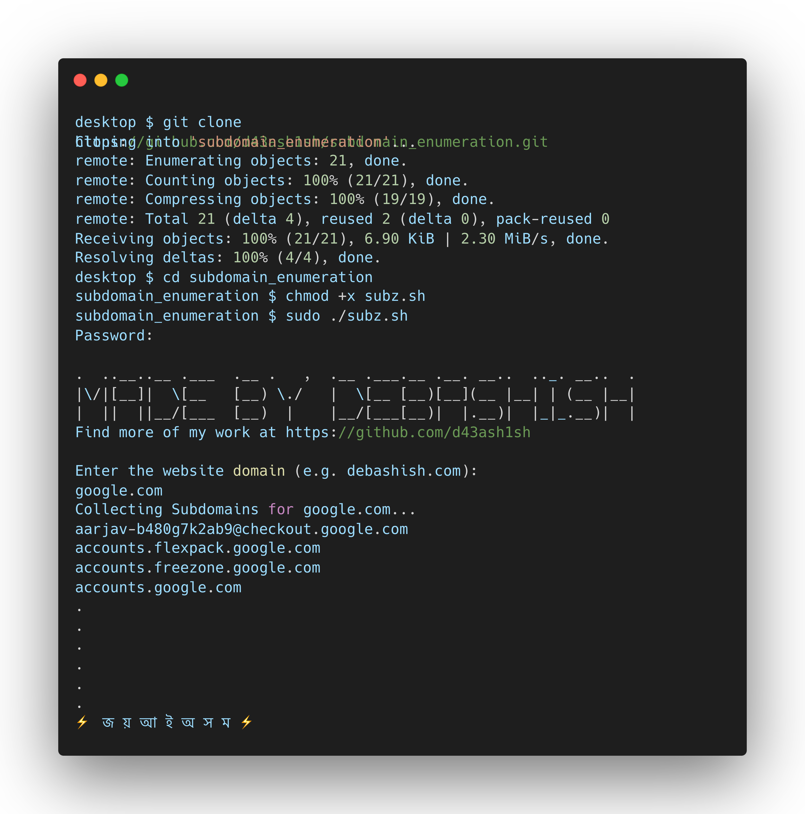

# Subdomain Enumeration (Subz)

Subz is a simple Bash script that helps you discover subdomains of a website. It uses the crt.sh website to collect subdomains and displays them in the terminal.

## Usage

To use the script, follow these steps:

1. Clone the repository using `git clone https://github.com/d43ash1sh/subdomain_enumeration`
2. Navigate to the cloned repository using `cd subdomain_enumeration`
3. Run the script using `./subz.sh`
4. Enter the domain name (e.g. debashish.com) when prompted
5. Wait for the script to finish, and the subdomains will be displayed in the terminal

## Compatibility

The script has been tested on macOS, Ubuntu, and CentOS. It should work on other Linux-based operating systems as well.

## Dependencies

The script requires the following dependencies to be installed on your system:

- `curl`
- `jq`

To install these dependencies on Ubuntu and Debian-based systems, run the following command:

`sudo apt-get install curl jq`

To install these dependencies on CentOS and Red Hat-based systems, run the following command:

`sudo yum install curl jq`

## Contact

If you have any questions or feedback, feel free to contact me:

- Instagram: [@d43ash1sh](https://www.instagram.com/d43ash1sh/)
- Twitter: [@d43a_io](https://twitter.com/d43a_io)
